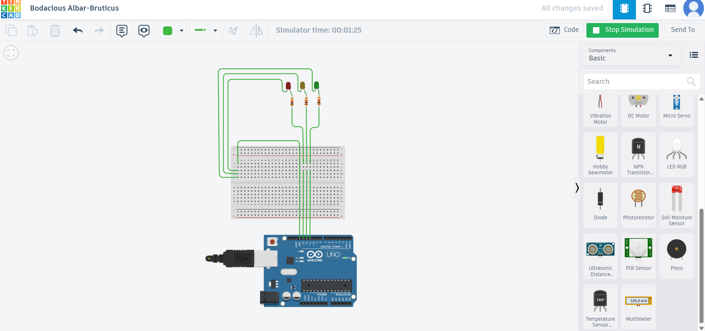

# arduino-led-control-tinkercad
Arduino-based LED control project designed and simulated using Tinkercad.  Includes circuit diagram, source code, and working explanation.
## Circuit Diagram

## Simulation
This project was designed and tested using Tinkercad Circuits.
